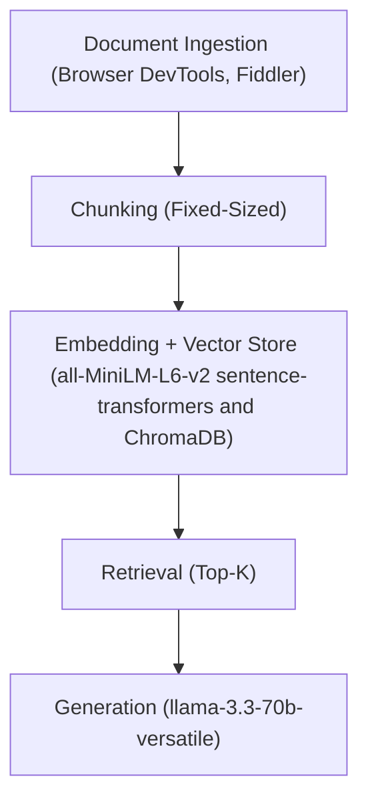

# Project 1 Planning: The Unofficial Guide

> Write this document before you write any pipeline code.
> Your spec and architecture diagram are what you'll use to direct AI tools (Claude, Copilot, etc.) to generate your implementation — the more specific they are, the more useful the generated code will be.
> Update the Retrieval Approach and Chunking Strategy sections if you change your approach during implementation.
> Update this file before starting any stretch features.

---

## Domain

<!-- What domain did you choose? Why is this knowledge valuable and hard to find through official channels? -->

The chosen domain is **Student reviews of CS 6515: Graduate Algorithms (GA) in the OMSCS program at Georgia Intitute of Technology**.

OMSCS is a leading online M.S. in Computer Science program with a large and diverse student and alumni community. 

CS 6515: Graduate Algorithms (GA) is a foundational graduate-level algorithms course and a core requirement for multiple OMSCS specializations. It is also one of the most challenging courses in the program, requiring students to develop strong algorithmic problem-solving skills and perform well on rigorous assessments. As a result, many students carefully research the course before enrolling to understand its difficulty, workload, study strategies, and common pitfalls.

This information is difficult to obtain through official channels because Georgia Tech does not maintain a centralized platform of student course reviews. Instead, relevant information is scattered across community-driven sources such as OMSHub (omshub.org), OMS Reviews (omscentral.com), and discussions on the r/OMSCS subreddit, making it challenging to discover, aggregate, and analyze systematically.

---

## Documents

<!-- List your specific sources: URLs, subreddit names, forum threads, or file descriptions.
     Aim for at least 10 sources that together cover different subtopics or perspectives within your domain. -->

| # | Source | Description | URL or location |
|---|--------|-------------|-----------------|
| 1 | OMS Reviews | Student reviews on OMS Reviews | https://www.omscentral.com/courses/introduction-to-graduate-algorithms/reviews |
| 2 | OMSHub | Student reviews on OMSHub | https://www.omshub.org/course/CS-6515 |
| 3 | Subreddit r/OMSCS | Passed CS6515 GA with A 97% Score, My Experience and Tips | https://www.reddit.com/r/OMSCS/comments/1pj9xen/passed_cs6515_ga_with_a_97_score_my_experience/ |
| 4 | Subreddit r/OMSCS | How to Pass Graduate Algorithms CS6515 | https://www.reddit.com/r/OMSCS/comments/1q0s8gw/how_to_pass_graduate_algorithms_cs6515/ |
| 5 | Subreddit r/OMSCS | CS6515 (Graduate Algorithms) - its true what they say... | https://www.reddit.com/r/OMSCS/comments/vleq4h/cs6515_graduate_algorithms_its_true_what_they_say/ |
| 6 | Subreddit r/OMSCS | Preparing for CS6515 Introduction to Graduate Algorithms in advance | https://www.reddit.com/r/OMSCS/comments/1k9jta5/preparing_for_cs6515_introduction_to_graduate/ |
| 7 | Subreddit r/OMSCS | Some notes for future GA students | https://www.reddit.com/r/OMSCS/comments/1hg51fx/some_notes_for_future_ga_students/ |
| 8 | Subreddit r/OMSCS | Study technique for CS6515 GA - My personal experience | https://www.reddit.com/r/OMSCS/comments/1idfnfi/study_technique_for_cs6515_ga_my_personal/ |
| 9 | Subreddit r/OMSCS | Graduate Algorithms (GA) Summer 2023 Final Review | https://www.reddit.com/r/OMSCS/comments/15ev3vm/graduate_algorithms_ga_summer_2023_final_review/ |
| 10 | Subreddit r/OMSCS | OSI False Accusation Survivor with Advice | https://www.reddit.com/r/OMSCS/comments/1h21nsz/osi_false_accusation_survivor_with_advice/ |

---

## Chunking Strategy

<!-- How will you split documents into chunks?
     State your chunk size (in tokens or characters), overlap size, and explain why those
     numbers fit the structure of your documents.
     A review-heavy corpus warrants different chunking than a long FAQ. -->

**Chunk size:** 300 tokens (~1,200 characters)

**Overlap:** 50 tokens (~200 characters)

**Reasoning:** Student reviews are generally self-contained, so a 300-token chunk size captures most reviews within a single chunk and preserves the semantic integrity of an individual student's experience. Larger chunks risk blending opinions from different students, semesters, or contexts, which can dilute sentiment and reduce retrieval accuracy. While Reddit posts are often longer and more variable, a 300-token limit typically aligns with paragraph boundaries where topics naturally shift. A 50-token overlap serves as a safety net for longer Reddit posts or unusually detailed reviews that must be split, ensuring important context is retained across adjacent chunks.

---

## Retrieval Approach

<!-- Which embedding model are you using (e.g., all-MiniLM-L6-v2 via sentence-transformers)?
     How many chunks will you retrieve per query (top-k)?
     If you were deploying this for real users and cost wasn't a constraint, what tradeoffs
     would you weigh in choosing a different embedding model — context length, multilingual
     support, accuracy on domain-specific text, latency? -->

**Embedding model:** all-MiniLM-L6-v2 via sentence-transformers

**Top-k:** 5 chunks

**Production tradeoff reflection:**

Without budget constraints, selecting a premium embedding model like text-embedding-3-large or a top-tier open-source alternative requires balancing context length against retrieval latency and domain accuracy. A longer native context window allows embedding entire lengthy reviews or complete Reddit threads as single vectors, preserving the structural context that smaller models fragment. However, larger embedding dimensions increase vector database search latency, which can degrade the real-time experience for active users. For a course taught in English, extensive multilingual support offers low marginal utility, though it assists in parsing non-standard syntax from global student cohorts. The primary focus must be accuracy on domain-specific text, ensuring that specialized computer science terminology and course-specific grading policies map precisely within the vector space. The optimal decision relies on verifying that the higher retrieval accuracy provided by deep domain mapping and long context lengths outweighs the increased latency during live user queries.

---

## Evaluation Plan

<!-- List your 5 test questions with their expected correct answers.
     Questions should be specific enough that you can judge whether the system's response
     is right or wrong. "What are good dining halls?" is too vague.
     "What do students say about wait times at [dining hall name] during lunch?" is testable. -->

| # | Question | Expected answer |
|---|----------|-----------------|
| 1 | Is GA a core course for all OMSCS specializations? | No. |
| 2 | Which OMSCS specializations do not require GA? | HCI (Human-Computer Interaction) and AI (Artificial Intelligence). |
| 3 | How many exams does GA typically have in recent semesters? | 3 exams. |
| 4 | What's the cut score to pass GA in recent semesters? | 70%. |
| 5 | Is homework graded in recent semesters? | Yes. TAs grade the homework and provide feedback, but it does not contribute to the final course grade. |

---

## Anticipated Challenges

<!-- What could go wrong? Name at least two specific risks with reasoning.
     Consider: noisy or inconsistent documents, missing source attribution, off-topic
     retrieval, chunks that split key information across boundaries. -->

1. Temporal anchor slippage caused by course structure drift across semesters. When student reviews from different semesters are aggregated into a single vector space, terms like recent, current, or last semester lose their absolute meaning. If the course format, exam weighting, or platform policies changed in a specific semester, chunks from older reviews will present outdated rules as current facts.

2. Propagation of subjective inaccuracies and student bias. Student reviews often contain factual errors, frequently driven by student frustration or a misunderstanding of course policies. When these inaccurate reviews are chunked and retrieved, the language model treats them as grounded context.

---

## Architecture

<!-- Draw a diagram of your pipeline showing the five stages:
     Document Ingestion → Chunking → Embedding + Vector Store → Retrieval → Generation
     Label each stage with the tool or library you're using.
     You can use ASCII art, a Mermaid diagram, or embed a sketch as an image.
     You'll use this diagram as context when prompting AI tools to implement each stage. -->

---

## AI Tool Plan

<!-- For each part of the pipeline below, describe:
     - Which AI tool you plan to use (Claude, Copilot, ChatGPT, etc.)
     - What you'll give it as input (which sections of this planning.md, which requirements)
     - What you expect it to produce
     - How you'll verify the output matches your spec

     "I'll use AI to help me code" is not a plan.
     "I'll give Claude my Chunking Strategy section and ask it to implement chunk_text()
     with my specified chunk size and overlap" is a plan. -->

**Milestone 3 — Ingestion and chunking:**

For Ingestion, I will manually extract review data using Fiddler and Browser DevTools to avoid anti-scraping restrictions since scraping is not a core part of this project. I will use Claude and Gemini for advice.

For chunking, I will use VS Code with GitHub Copilot for code generation. I will verify the chunking by checking five random chunks to confirm they meet the 300 token limit and 50 token overlap.

**Milestone 4 — Embedding and retrieval:**

I will use VS Code with GitHub Copilot to generate the ChromaDB and all-MiniLM-L6-v2 embedding logic. The input provided to the AI will be the Retrieval Approach section and the relevant sentence-transformers and ChromaDB specifications from the Architecture diagram.

I will verify the function by running the five evaluation queries and inspecting the top 5 retrieved chunks for relevance.

**Milestone 5 — Generation and interface:**

I will use VS Code with GitHub Copilot to for code generation, utilizing Claude and Gemini for prompt engineering advice. I will input the Evaluation Plan to build the llama-3.3-70b-versatile integration. I will verify the final pipeline by running the test questions and comparing outputs to the expected answers.
